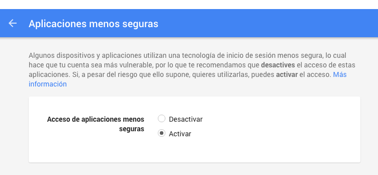

## Revisa correo de gmail

1. Lista correos no leidos: ok
2. Listar correos no leidos de hace 1 hora
3. CLI : slop?, thor?
4.
5.
6.
7.


#Troubleshoot

1. I cannot access to my gmail account, with an error like this.


```
/Users/Nico/.rbenv/versions/2.2.3/lib/ruby/2.2.0/net/imap.rb:1173:in `get_tagged_response': Unknown command w73mb81838384vkw (Net::IMAP::BadResponseError)
	from /Users/Nico/.rbenv/versions/2.2.3/lib/ruby/2.2.0/net/imap.rb:1225:in `block in send_command'
	from /Users/Nico/.rbenv/versions/2.2.3/lib/ruby/2.2.0/monitor.rb:211:in `mon_synchronize'
	from /Users/Nico/.rbenv/versions/2.2.3/lib/ruby/2.2.0/net/imap.rb:1207:in `send_command'
	from /Users/Nico/.rbenv/versions/2.2.3/lib/ruby/2.2.0/net/imap.rb:453:in `block in select'
	from /Users/Nico/.rbenv/versions/2.2.3/lib/ruby/2.2.0/monitor.rb:211:in `mon_synchronize'
	from /Users/Nico/.rbenv/versions/2.2.3/lib/ruby/2.2.0/net/imap.rb:451:in `select'
	from /Users/Nico/.rbenv/versions/2.2.3/lib/ruby/gems/2.2.0/gems/gmail-0.6.0/lib/gmail/client/base.rb:207:in `switch_to_mailbox'
	from /Users/Nico/.rbenv/versions/2.2.3/lib/ruby/gems/2.2.0/gems/gmail-0.6.0/lib/gmail/client/base.rb:164:in `block in mailbox'
	from /Users/Nico/.rbenv/versions/2.2.3/lib/ruby/gems/2.2.0/gems/gmail-0.6.0/lib/gmail/client/base.rb:161:in `synchronize'
	from /Users/Nico/.rbenv/versions/2.2.3/lib/ruby/gems/2.2.0/gems/gmail-0.6.0/lib/gmail/client/base.rb:161:in `mailbox'
	from /Users/Nico/.rbenv/versions/2.2.3/lib/ruby/gems/2.2.0/gems/gmail-0.6.0/lib/gmail/client/base.rb:184:in `inbox'
	from gmail.rb:11:in `unread'
	from gmail.rb:42:in `<main>'
  ```

  
